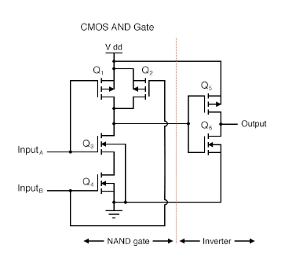

Schematic:

<table>
<tr>
<td valign="top">
    
</td>
<td valign="top">
    
</td>
</tr>
<tr>
<td colspan="2" valign="top">
    
</td>
</tr>
</table>

 

Links and References:

- https://www.allaboutcircuits.com/textbook/digital/chpt-3/cmos-gate-circuitry/

